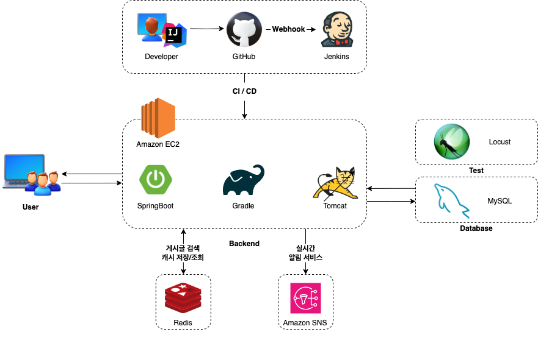
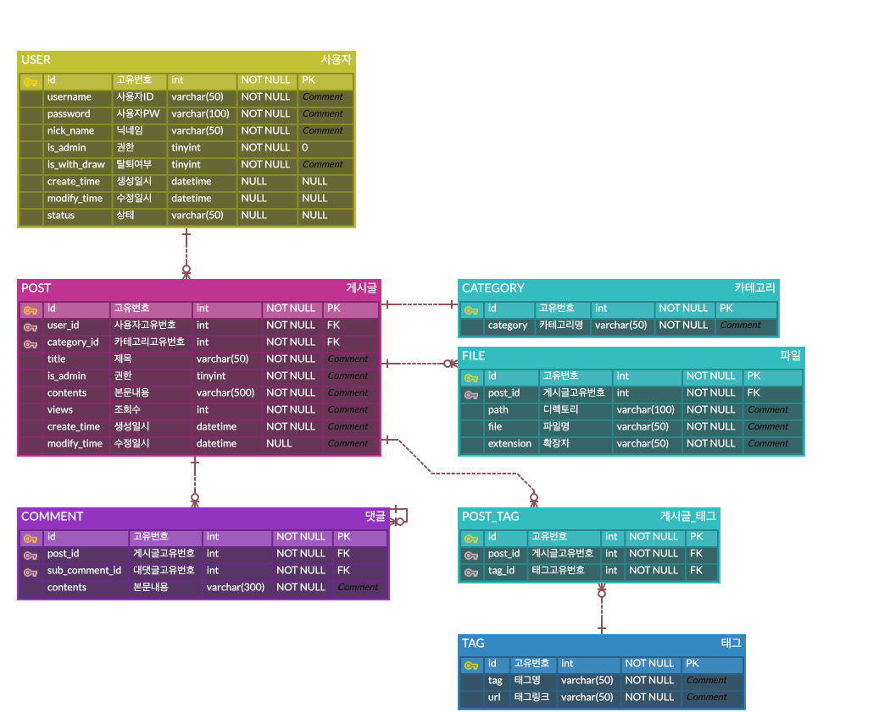
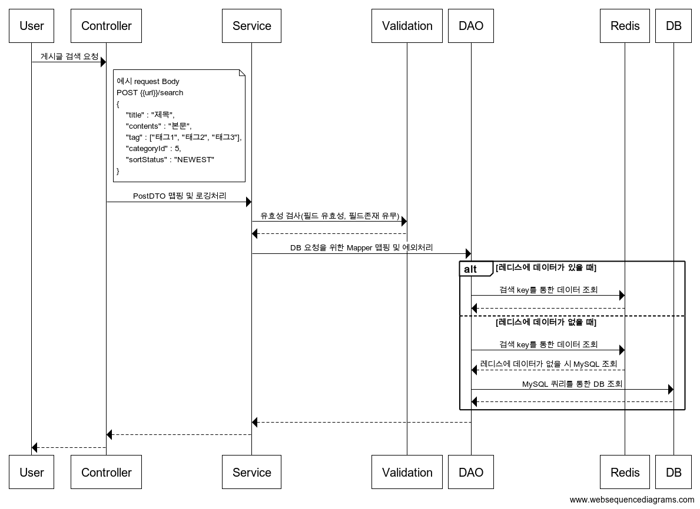

# high-traffic Community
### 🎯 Goals
- 대용량 트래픽 처리 어플리케이|션 개발 (1000TPS 이상의 게시글검색 API 구현)
- 객체지향(OOP) 및 관점지향(AOP) 프로그래밍 원칙 준수를 통한 확장성 & 유지보수성을 고려한 설계
- Redis 활용을 통한 게시글검색 API 성능 최적화 및 응답속도 향상
- AWS SNS와 Webhook을 활용한 실시간 알림서비스 구현
- Jenkins를 활용한 CI/CD 파이프라인 구축으로 개발 생산성 및 효율성 향상

### 🗂️ Implemented Feature List
|구분| 구현기능                                                                                                         |
|:---:|--------------------------------------------------------------------------------------------------------------|
|User| - 회원가입, 회원탈퇴   - 로그인, 로그아웃   - 회원정보 조회, 비밀번호 변경                                                        |
|Category| - 카테고리 등록, 수정, 삭제                                                                                            |
|Post| - 게시글 등록, 수정, 삭제   - 사용자 게시글 조회   - 사용자가 입력한 제목 & 본문 & 카테고리 기반 게시글 조회 및 정렬   - 사용자가 입력한 태그 기반 게시글 조회|
|Comment| - 게시글 댓글 등록, 수정, 삭제|
|Tag|- 태그 등록, 수정, 삭제|
|SNS|- SNS 토픽 생성   - 토픽 구독   - 메시지 게시|

### 🛠️ Project Architecture

- Language : Java (JDK 17)
- Framework : SpringBoot 3.3.5
- Database : MySQL 8.0 & MyBatis, Redis 3.1.0
- Test : Locust & Python3

### ✏️ Project Docs
|**ERD**|**Sequence**|
|:---:|:---:|
|||

### 🚀 Locust 테스트 및 성능개선
#### 1️⃣ 데이터 준비
|                **성능테스트를 위한 DB 데이터 자동삽입**                 | **게시글 조회 시뮬레이션 코드** |
|:--------------------------------------------------------:|:-------------------:|
|  ||

#### 2️⃣ STRESS 테스트
- 500명의 동시 사용자가 초당 50번 호출 →  분당(5분) 사용자를 50씩 늘린 후 지표확인

|                            **개선 전**                            |                            **개선 후**                            |
|:--------------------------------------------------------------:|:--------------------------------------------------------------:|
|   |   |

| **비교항목**       |**개선 전**|**개선 후**| **개선효과**    |
|----------------|-------|-------|-------------|
| 요청 합계          |25,646|118,879| - 4.6배 증가   |
| 평균 응답 시간(ms)   |5309.41|6.01| - 99.88% 감소 |
| 초당 평균 요청 수(RPS)|85.21|394.09| - 4.6배 증가   |